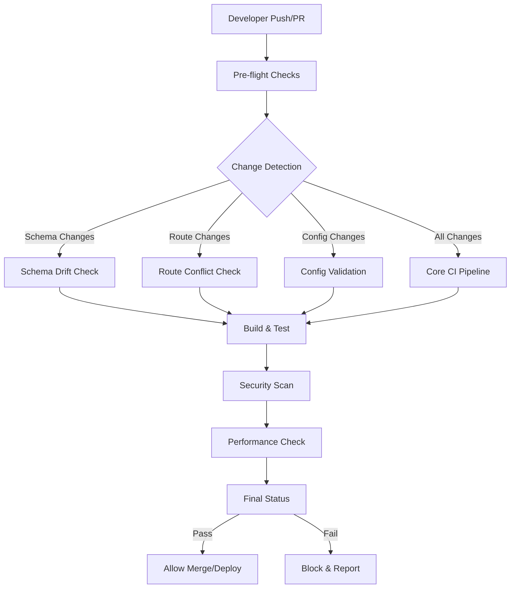

# CI Protection Strategy - MS Elevate LEAPS Tracker

## Overview

This document outlines the comprehensive CI protection system implemented to prevent critical issues from reoccurring in the MS Elevate LEAPS Tracker project. The strategy consists of multiple layers of automated checks that catch problems early and prevent bad deployments.

## 🎯 Protection Objectives

### Primary Goals
1. **Prevent Regression** - Catch and prevent reoccurrence of previously fixed critical issues
2. **Fail Fast** - Detect problems as early as possible in the development cycle
3. **Comprehensive Coverage** - Protect all critical aspects of the application
4. **Developer Experience** - Provide clear, actionable feedback for quick issue resolution
5. **Quality Assurance** - Maintain high standards across all code changes

### Critical Issues Protected Against
- ✅ Database schema drift between Prisma schema and database
- ✅ Route conflicts (sitemap and Next.js routing conflicts)
- ✅ Vercel configuration drift and deployment issues  
- ✅ Build artifact policy violations and git repository pollution
- ✅ Git repository hygiene problems
- ✅ Turbo cache performance degradation
- ✅ Security vulnerabilities and secret exposure
- ✅ Performance regressions

## 🏗️ Architecture

### Multi-Layer Protection System



### Workflow Orchestration

The CI protection system consists of several specialized workflows that work together:

1. **Main CI Pipeline** (`ci.yml`) - Core integration and testing
2. **Specialized Protection Workflows** - Targeted issue prevention
3. **Health Monitoring** - Ongoing system health assessment
4. **Comprehensive Reporting** - Centralized health status and reporting

## 📋 Workflow Details

### 1. Main CI Pipeline (`ci.yml`)

**Purpose**: Primary continuous integration with fail-fast protection

**Triggers**:
- Push to `main` or `staging` branches
- Pull requests to `main` or `staging` branches

**Key Features**:
- **Pre-flight checks** with intelligent change detection
- **Matrix testing** across Node.js versions
- **Parallel execution** for fast feedback
- **Conditional workflow execution** based on changes
- **Security scanning** with multiple tools
- **Build verification** with artifact upload
- **Coverage reporting** with Codecov integration

**Protection Areas**:
- ✅ Git hygiene (merge conflicts, large files, tracked artifacts)
- ✅ TypeScript compilation
- ✅ Linting and code quality
- ✅ Unit and integration tests
- ✅ Build verification
- ✅ Security scanning
- ✅ Dependency audits

### 2. Database Schema Drift Detection (`db-drift-check.yml`)

**Purpose**: Prevent schema drift between Prisma schema and database

**Triggers**:
- PRs modifying Prisma schema or migrations
- Push to main/staging with schema changes
- Daily schedule (2 AM UTC)
- Manual dispatch

**Key Features**:
- **Comprehensive drift analysis** using Prisma migrate diff
- **Migration integrity validation** to prevent modification of existing migrations
- **Automated PR comments** with detailed fix instructions
- **Production alerting** via GitHub issues for scheduled checks
- **RLS policy validation** for security

**Protection Areas**:
- ✅ Prisma schema vs database consistency
- ✅ Migration file integrity
- ✅ Prisma client sync status
- ✅ Row Level Security policy presence

**Error Messages**:
```bash
❌ Schema drift detected!
Required changes to align database with Prisma:
[SQL diff output]

🛠️ To fix this drift:
1. Review the changes above
2. Run: pnpm db:push (for development)
3. Or create a migration: pnpm scripts/db/generate-migrations.sh
4. Apply the migration: supabase db push
```

### 3. Route Conflict Detection (`route-conflict-check.yml`)

**Purpose**: Prevent Next.js routing conflicts and sitemap issues

**Triggers**:
- PRs modifying app routes, pages, or sitemap files
- Push to main/staging with route changes

**Key Features**:
- **Sitemap conflict detection** (multiple sitemap files, sitemap + route.ts conflicts)
- **Route/page conflict detection** (route.ts + page.tsx in same directory)
- **Duplicate route path detection** across apps
- **Special route conflict detection** (conflicts with Next.js reserved routes)
- **Route documentation generation** on main branch updates

**Protection Areas**:
- ✅ Sitemap file conflicts
- ✅ Route/page shadowing
- ✅ Duplicate route paths
- ✅ Next.js special route conflicts

**Error Messages**:
```bash
❌ Route conflicts detected:
- Multiple sitemap files in apps/web
- Both route.ts and page.tsx exist in /dashboard
- Duplicate route path '/api/users' in multiple locations

🛠️ Fix suggestions:
- Remove duplicate sitemap files, keep only one per app
- Choose either route.ts (API) or page.tsx (page) per directory
- Ensure unique route paths across your application
```

### 4. Vercel Configuration Validation (`vercel-config-validation.yml`)

**Purpose**: Ensure proper Vercel deployment configuration

**Triggers**:
- PRs modifying vercel.json or deployment scripts
- Push to main/staging with config changes
- Weekly scheduled validation
- Manual dispatch

**Key Features**:
- **Multi-app configuration validation** (web + admin)
- **Build command verification** for monorepo setup
- **Environment variable reference checking**
- **Security header validation**
- **Deployment script consistency checks**

**Protection Areas**:
- ✅ Vercel.json syntax and structure
- ✅ Build command correctness for monorepo
- ✅ Output directory configuration
- ✅ Function configuration
- ✅ Security headers setup
- ✅ Package.json consistency

**Error Messages**:
```bash
❌ Vercel configuration validation failed:
- Project name should be 'elevate-web', found: 'wrong-name'
- Build command incorrect for monorepo
- Missing security headers configuration

🛠️ Fix configuration:
{
  "name": "elevate-web",
  "buildCommand": "pnpm turbo run build --filter=web",
  "headers": [
    {
      "source": "/(.*)",
      "headers": [{"key": "X-App-Name", "value": "elevate-web"}]
    }
  ]
}
```

### 5. Build Artifact Policy Enforcement (`build-policy-enforcement.yml`)

**Purpose**: Prevent build artifacts from polluting the repository

**Triggers**:
- PRs modifying package source or build configs
- Push to main/staging with package changes
- Daily scheduled audit
- Manual dispatch with options

**Key Features**:
- **Git tracking analysis** (prevents tracking of dist/, *.tsbuildinfo)
- **Package configuration audit** (tsup clean: true, proper entry points)
- **Build consistency verification** (clean builds, hash verification)
- **Turbo cache impact analysis**
- **Security and cleanup validation**

**Protection Areas**:
- ✅ No tracked build artifacts in git
- ✅ Proper .gitignore configuration
- ✅ Package build script configuration
- ✅ TypeScript compilation success
- ✅ Build hash verification

**Error Messages**:
```bash
❌ Build artifact policy violations:
- Found tracked dist files: packages/ui/dist/index.js
- tsup.config.ts missing 'clean: true' option
- .gitignore missing 'dist/' pattern

🛠️ Fix violations:
# Remove tracked artifacts
git rm -r --cached packages/*/dist/
echo "dist/" >> .gitignore

# Fix tsup config
// tsup.config.ts
export default defineConfig({
  entry: ['src/index.ts'],
  clean: true, // ← Important!
})
```

### 6. Git Repository Hygiene Checks (`git-hygiene-check.yml`)

**Purpose**: Maintain clean repository standards and best practices

**Triggers**:
- All pull requests
- Push to main/staging
- Weekly scheduled audit
- Manual dispatch with auto-fix option

**Key Features**:
- **Repository structure analysis** (file counts, directory structure)
- **File tracking hygiene** (large files, binary files, sensitive files)
- **Commit message quality analysis** (conventional commit format)
- **Branch and merge analysis** (stale branches, merge commit ratios)
- **Security analysis** (file permissions, symlinks, hidden files)
- **Auto-fix capabilities** for minor issues

**Protection Areas**:
- ✅ No large files (>10MB) tracked
- ✅ No build artifacts tracked
- ✅ No sensitive files tracked
- ✅ Proper .gitignore completeness
- ✅ Quality commit messages
- ✅ Clean branch hygiene

**Error Messages**:
```bash
❌ Git hygiene violations:
- Found large file: assets/video.mp4 (50MB)
- Build artifacts tracked: packages/ui/dist/
- .gitignore missing essential patterns

🛠️ Fix hygiene issues:
# Remove large files
git rm --cached assets/video.mp4
echo "*.mp4" >> .gitignore

# Remove build artifacts
git rm -r --cached packages/*/dist/
echo "dist/" >> .gitignore
```

### 7. Turbo Cache Health Monitoring (`turbo-cache-health.yml`)

**Purpose**: Ensure optimal build performance through effective caching

**Triggers**:
- PRs modifying turbo.json or package configs
- Push to main/staging with turbo changes
- Daily scheduled monitoring
- Manual dispatch with benchmark options

**Key Features**:
- **Configuration validation** (turbo.json syntax, task configuration)
- **Cache performance benchmarking** (cold vs warm build times)
- **Cache hit rate analysis** (multiple run consistency tests)
- **Remote cache evaluation** (signature verification, environment setup)
- **Optimization recommendations** based on performance metrics

**Protection Areas**:
- ✅ Valid turbo.json configuration
- ✅ Proper task caching setup
- ✅ Effective cache performance (>50% improvement)
- ✅ Cache directory integrity
- ✅ Remote cache configuration

**Error Messages**:
```bash
❌ Cache performance issues:
- Cache improvement less than 20% (expected >50%)
- turbo.json missing outputs configuration
- Remote cache signature verification disabled

🛠️ Optimize cache:
{
  "tasks": {
    "build": {
      "cache": true,
      "outputs": ["dist/**", ".next/**"]
    }
  },
  "remoteCache": {
    "signature": true
  }
}
```

### 8. Comprehensive Health Check (`comprehensive-health-check.yml`)

**Purpose**: Orchestrate all protection systems for holistic health assessment

**Triggers**:
- Weekly scheduled check (Sundays 3 AM UTC)
- Manual dispatch with scope options

**Key Features**:
- **Orchestrated execution** of all specialized health checks
- **Comprehensive reporting** with executive summary
- **Health score calculation** based on all components
- **Critical issue alerting** via GitHub issues
- **Trend analysis** and recommendations
- **Configurable scope** (full, critical, performance, security)

**Protection Areas**:
- ✅ All individual protection systems
- ✅ Cross-system health correlation
- ✅ Historical trend analysis
- ✅ Comprehensive reporting

## 🚀 Usage Guide

### For Developers

#### Understanding CI Feedback

When a CI check fails, you'll receive:

1. **Clear error messages** explaining what went wrong
2. **Specific fix instructions** with code examples
3. **Links to relevant documentation** and resources
4. **Artifacts** with detailed analysis results

#### Common Scenarios

**Schema Changes**:
```bash
# After modifying packages/db/schema.prisma
git add packages/db/schema.prisma
git commit -m "feat: add user preferences table"
git push origin feature/user-preferences

# CI will automatically run schema drift check
# If drift detected, follow PR comment instructions
```

**Route Changes**:
```bash
# Adding new routes or sitemap files
# CI will check for conflicts automatically
# Fix any conflicts before merge
```

**Configuration Changes**:
```bash
# Modifying vercel.json or turbo.json
# CI will validate configuration syntax and settings
# Address any validation errors
```

#### Local Testing

Run checks locally before pushing:

```bash
# Check schema drift
pnpm db:check-drift

# Verify build policy
pnpm build:check

# Run security scan
pnpm verify:secrets

# Validate Vercel config
node scripts/verify-vercel-config.js

# Full CI simulation
pnpm ci
```

### For Maintainers

#### Managing CI Protection

**Enabling/Disabling Checks**:
- Individual workflows can be disabled via GitHub Actions settings
- Use workflow dispatch inputs for selective checking
- Modify trigger conditions in workflow files

**Updating Protection Rules**:
- Modify workflow files in `.github/workflows/`
- Update protection scripts in `scripts/` directory
- Test changes thoroughly before merging

**Monitoring System Health**:
- Review weekly health check reports
- Monitor workflow success rates
- Address recurring issues promptly

#### Emergency Procedures

**Critical Issues**:
1. Critical issues trigger automatic GitHub issue creation
2. Issues are labeled with priority and component tags
3. Follow issue instructions for resolution
4. Verify fixes with targeted re-runs

**Bypassing Checks** (Emergency Only):
1. Use GitHub Settings → Branches → Allow bypassing
2. Require admin approval for bypass
3. Document bypass reason and follow-up actions
4. Re-enable protection immediately after fix

## 📊 Monitoring and Metrics

### Success Metrics

**Protection Effectiveness**:
- 📊 Issue prevention rate (issues caught before merge)
- ⚡ Mean time to detection (MTTD)
- 🔧 Mean time to resolution (MTTR)
- 📈 Developer productivity impact

**System Health Indicators**:
- ✅ CI success rate (target: >95%)
- ⏱️ Average CI duration (target: <10 minutes)
- 🔄 False positive rate (target: <5%)
- 📋 Issue recurrence rate (target: <2%)

### Reporting

**Weekly Health Reports**:
- Comprehensive system health assessment
- Component-level health scores
- Trend analysis and recommendations
- Action items and priorities

**Real-time Monitoring**:
- GitHub Actions workflow status
- Protection system effectiveness
- Performance metrics and alerts

## 🔧 Maintenance

### Regular Tasks

**Weekly**:
- Review comprehensive health reports
- Update protection rules based on findings
- Monitor false positive rates
- Update documentation

**Monthly**:
- Review and update workflow dependencies
- Analyze protection effectiveness metrics
- Update security scanning rules
- Performance optimization review

**Quarterly**:
- Comprehensive protection strategy review
- Update protection patterns for new threats
- Workflow performance optimization
- Developer feedback integration

### Troubleshooting

**Common Issues**:

1. **CI Timeouts**:
   - Check for infinite loops in checks
   - Optimize performance benchmarks
   - Increase timeout limits if necessary

2. **False Positives**:
   - Review detection logic
   - Add exceptions for valid cases
   - Improve error messages

3. **Performance Impact**:
   - Parallelize checks where possible
   - Cache intermediate results
   - Optimize check algorithms

**Support Resources**:
- [GitHub Actions Documentation](https://docs.github.com/en/actions)
- [Workflow Troubleshooting Guide](.github/WORKFLOWS.md)
- [Project Documentation](../CLAUDE.md)

## 🛡️ Security Considerations

### Secret Management
- All workflows use GitHub Secrets for sensitive data
- No secrets in workflow files or scripts
- Regular secret rotation and access review

### Access Control
- Workflows run with minimal required permissions
- No unnecessary repository write access
- Audit logging for all protection actions

### Compliance
- SOC 2 compliance considerations
- Data privacy protection
- Audit trail maintenance

## 🔄 Future Enhancements

### Planned Improvements

**Short Term (1-3 months)**:
- Machine learning-based anomaly detection
- Enhanced performance trend analysis
- Integration with external monitoring tools
- Advanced reporting dashboards

**Medium Term (3-6 months)**:
- Predictive issue detection
- Automated fix suggestions
- Cross-repository protection patterns
- Advanced security scanning

**Long Term (6+ months)**:
- AI-powered code quality analysis
- Automated dependency updates
- Performance regression prediction
- Self-healing infrastructure

### Extension Points

**Custom Checks**:
- Add new workflow files following existing patterns
- Extend existing checks with additional rules
- Integrate third-party tools and services

**Reporting Enhancements**:
- Custom metric collection
- External dashboard integration
- Notification customization

---

## 📞 Support

For questions, issues, or improvements to the CI protection system:

- **Documentation**: Review this guide and linked resources
- **Issues**: Create GitHub issues with `ci-protection` label
- **Discussions**: Use GitHub Discussions for strategy questions
- **Emergency**: Follow emergency procedures for critical issues

**Maintainer Contact**:
- Primary: Development Team
- Escalation: Technical Lead
- Critical Issues: On-call Engineering