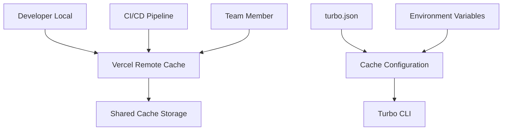

# Turbo Remote Cache Configuration Guide

This document provides comprehensive information about the Turbo remote caching setup for the MS Elevate LEAPS Tracker project.

## Overview

Turbo remote caching dramatically improves build performance by sharing cached task outputs across team members and CI/CD environments. This eliminates redundant work and can reduce build times by 30-70%.

## Architecture



## Configuration Files

### 1. turbo.json

The main configuration file that defines:
- Remote cache settings with signature verification
- Cacheable tasks with explicit `cache: true`
- Output directories for each task
- Task dependencies

```json
{
  "remoteCache": {
    "signature": true
  },
  "tasks": {
    "build": {
      "outputs": ["dist/**", ".next/**", "!.next/cache/**"],
      "cache": true
    }
  }
}
```

### 2. vercel.json

Deployment configuration that ensures cache tokens are available:

```json
{
  "env": {
    "TURBO_TOKEN": "@turbo_token",
    "TURBO_TEAM": "@turbo_team"
  }
}
```

### 3. Environment Variables

Required variables for remote caching:

```bash
# Vercel Remote Cache Token
TURBO_TOKEN=your-vercel-turborepo-token

# Optional: Team identifier
TURBO_TEAM=your-team-slug
```

## Setup Process

### 1. Initial Setup

Run the setup script to configure remote caching:

```bash
# Basic setup (local cache only)
pnpm setup:cache

# With remote cache token
TURBO_TOKEN="your-token" pnpm setup:cache
```

### 2. Get Turbo Token

1. Visit [Vercel Account Tokens](https://vercel.com/account/tokens)
2. Create a new token with scope "Turborepo Remote Cache"
3. Add the token to your environment:

```bash
# For local development
echo "TURBO_TOKEN=your-token-here" >> .env.local

# For CI/CD (Vercel)
# Add as environment variable in Vercel dashboard
```

### 3. Verify Setup

Check that remote caching is working:

```bash
# Check cache status
pnpm cache:status

# Run build with cache summary
pnpm turbo run build --summarize
```

## Cache Management

### Status Monitoring

```bash
# Full status report
pnpm cache:status

# Summary only
pnpm cache:status --summary

# JSON output for automation
pnpm cache:analyze
```

### Cache Cleanup

```bash
# Interactive cleanup menu
pnpm cache:clean

# Clean all cache entries
pnpm cache:clean --clean

# Clean entries older than 7 days
pnpm cache:clean --old 7

# Full optimization (clean + verify)
pnpm cache:optimize
```

### Available Scripts

| Script | Description |
|--------|-------------|
| `pnpm setup:cache` | Initial cache setup |
| `pnpm cache:status` | View cache status |
| `pnpm cache:clean` | Interactive cache cleanup |
| `pnpm cache:analyze` | JSON cache analysis |
| `pnpm cache:optimize` | Optimize cache performance |

## Cached Tasks

The following tasks are configured for caching:

### Build Tasks
- `typecheck` - TypeScript type checking
- `build:types` - TypeScript declaration generation
- `build:js` - JavaScript compilation
- `build` - Full application build

### Quality Tasks
- `lint` - ESLint code analysis
- `test` - Jest/Vitest test execution

### API Tasks
- `api:extract` - API documentation extraction
- `api:check` - API compatibility checks

## Performance Impact

### Expected Improvements

| Cache State | Build Time Reduction |
|-------------|---------------------|
| Cold cache | 0% (first run) |
| Warm local cache | 15-40% |
| Warm remote cache | 30-70% |
| Full team cache | 50-80% |

### Metrics

Track these metrics to measure cache effectiveness:

```bash
# Cache hit rate
turbo run build --summarize | grep "cache hit"

# Build time comparison
time turbo run build --force  # Without cache
time turbo run build          # With cache
```

## Troubleshooting

### Common Issues

#### 1. Remote Cache Connection Failed

```bash
# Check token validity
turbo login --token="$TURBO_TOKEN"

# Verify environment variables
echo $TURBO_TOKEN
```

**Solutions:**
- Regenerate token at vercel.com/account/tokens
- Ensure token has "Turborepo Remote Cache" scope
- Check network connectivity

#### 2. Cache Not Populating

```bash
# Verify cache configuration
cat turbo.json | grep -A5 '"cache"'

# Check task execution
turbo run build --dry-run
```

**Solutions:**
- Ensure `"cache": true` in task configuration
- Verify output directories exist
- Check for build errors

#### 3. Large Cache Size

```bash
# Analyze cache contents
pnpm cache:clean --analyze

# Clean old entries
pnpm cache:clean --old 7
```

**Solutions:**
- Regular cache cleanup schedule
- Optimize output directory patterns
- Consider cache size limits

### Debug Commands

```bash
# Verbose turbo execution
turbo run build --verbose

# Force rebuild (bypass cache)
turbo run build --force

# Cache statistics
turbo run build --summarize

# Dry run to see what would execute
turbo run build --dry-run
```

## Security Considerations

### Token Security

- **Never commit tokens to version control**
- Use environment variables or Vercel secrets
- Rotate tokens regularly (every 90 days)
- Use minimal token scopes

### Cache Integrity

- Signature verification is enabled (`signature: true`)
- Cache entries are content-addressable
- Tampering is automatically detected
- Invalid entries are ignored

### Access Control

- Tokens are scoped to specific teams/projects
- Remote cache access is logged
- Team members can't access other teams' caches

## CI/CD Integration

### Vercel Deployment

Remote cache tokens are automatically available in Vercel deployments:

```json
{
  "env": {
    "TURBO_TOKEN": "@turbo_token",
    "TURBO_TEAM": "@turbo_team"
  }
}
```

### GitHub Actions (if used)

```yaml
env:
  TURBO_TOKEN: ${{ secrets.TURBO_TOKEN }}
  TURBO_TEAM: ${{ secrets.TURBO_TEAM }}

steps:
  - name: Install dependencies
    run: pnpm install --frozen-lockfile
    
  - name: Build with cache
    run: pnpm turbo run build --summarize
```

## Monitoring and Analytics

### Cache Effectiveness

Track cache performance over time:

```bash
# Weekly cache report
./scripts/cache-status.sh --json > cache-report-$(date +%Y%m%d).json

# Build time tracking
echo "$(date): $(time pnpm turbo run build 2>&1)" >> build-times.log
```

### Recommendations

- **Daily**: Monitor cache status during development
- **Weekly**: Clean old cache entries (`pnpm cache:clean --old 7`)
- **Monthly**: Full cache analysis and optimization
- **Quarterly**: Review and rotate access tokens

## Best Practices

### Development Workflow

1. **Start with clean cache** for major changes
2. **Use cache status** to monitor performance
3. **Share cache hits** with team via remote cache
4. **Clean regularly** to maintain performance

### Cache Optimization

```bash
# Optimal build command
pnpm turbo run build lint typecheck test --parallel

# Cache warming for new team members
pnpm turbo run build --force  # First run
pnpm turbo run build          # Cached run
```

### Team Collaboration

- Share the same `TURBO_TEAM` identifier
- Use consistent Node.js versions
- Coordinate cache cleanup schedules
- Document cache-affecting changes

## Migration Guide

### From No Cache

1. Update `turbo.json` with cache configuration
2. Set up environment variables
3. Run initial builds to populate cache
4. Monitor cache effectiveness

### From Local Cache Only

1. Obtain Vercel remote cache token
2. Configure environment variables
3. Test remote cache connection
4. Verify team can access shared cache

## Support and Resources

### Documentation Links

- [Turbo Remote Caching](https://turbo.build/repo/docs/core-concepts/remote-caching)
- [Vercel Remote Cache](https://vercel.com/docs/concepts/monorepos/remote-caching)
- [Turbo Configuration](https://turbo.build/repo/docs/reference/configuration)

### Internal Resources

- Setup Script: `./scripts/setup-remote-cache.sh`
- Status Script: `./scripts/cache-status.sh`
- Cleanup Script: `./scripts/cache-clean.sh`
- Project Documentation: `./CLAUDE.md`

### Getting Help

1. Check cache status: `pnpm cache:status`
2. Review troubleshooting section above
3. Consult Turbo documentation
4. Contact development team

---

**Last Updated:** $(date +%Y-%m-%d)
**Version:** 1.0.0
**Maintainer:** MS Elevate Development Team