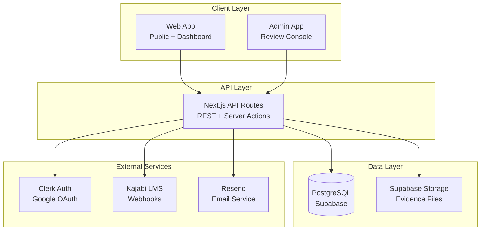
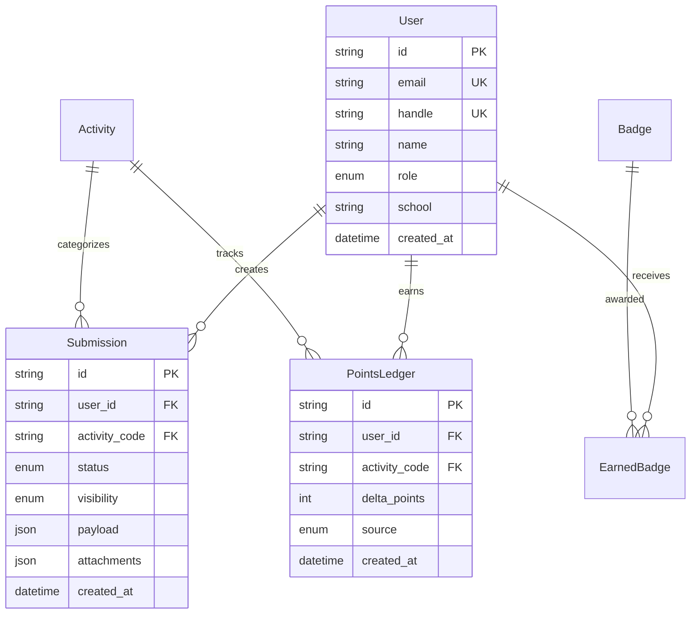
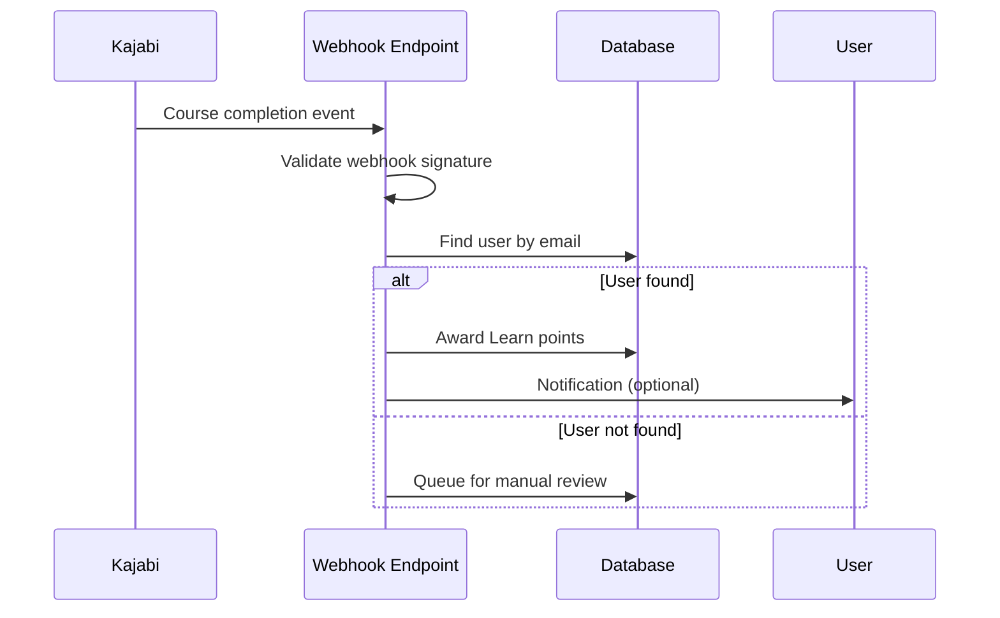
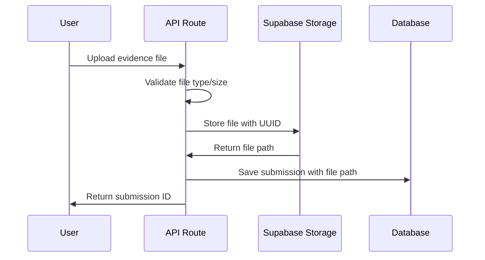
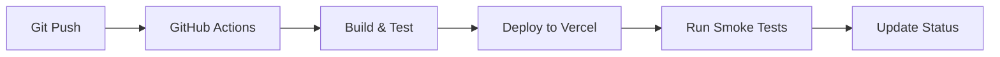

## Architecture Overview

High-level system design for the MS Elevate LEAPS Tracker platform.

## System Context

### Purpose

Platform for Indonesian educators to progress through the LEAPS framework (Learn, Explore, Amplify, Present, Shine) while adopting AI in classrooms. Supports 25k+ educators with gamification, evidence submission, and public recognition.

### Key Stakeholders

- **Educators**: Primary users progressing through LEAPS stages
- **Reviewers**: Approve submissions and award points
- **Admins**: Manage users, export data, handle integrations
- **Microsoft Indonesia**: Program sponsor and stakeholder

## High-Level Architecture



## Application Architecture

### Monorepo Structure

```
elevate/
├── apps/
│   ├── web/           # Public site + participant dashboard (Next.js)
│   └── admin/         # Admin console (Next.js)
├── packages/
│   ├── auth/          # Authentication utilities
│   ├── db/            # Database schema + utilities
│   ├── ui/            # Shared components
│   ├── types/         # TypeScript definitions
│   ├── http/          # API client + envelopes
│   └── logging/       # Structured logging
```

### Design Principles

1. **Separation of Concerns**: Web and Admin apps are separate deployments
2. **Shared Libraries**: Common functionality in packages/
3. **Type Safety**: End-to-end TypeScript with strict validation
4. **Security First**: Server-side validation, RBAC, audit logging
5. **Performance**: Caching, materialized views, optimized queries

## Data Architecture

### Core Entities



### Data Flow

1. **Submission Flow**: User submits evidence → Reviewer approves → Points awarded → Leaderboard updated
2. **Kajabi Integration**: Course completion → Webhook → Auto-award Learn points
3. **Public Data**: Approved + public submissions appear on profiles and metrics

## Security Architecture

### Authentication & Authorization

- **Authentication**: Clerk with Google OAuth only
- **Authorization**: Role-based (Participant, Reviewer, Admin, Superadmin)
- **Session Management**: Clerk handles tokens and sessions

### Data Protection

- **PII Handling**: Minimal collection, explicit consent for public profiles
- **File Security**: Signed URLs for evidence files, private by default
- **Audit Logging**: All admin actions logged with actor, action, target

### API Security

- **Input Validation**: Zod schemas on all endpoints
- **Rate Limiting**: Per-user and per-endpoint limits
- **CSRF Protection**: Built-in Next.js protection
- **SQL Injection**: Prisma ORM prevents direct SQL

## Performance Architecture

### Caching Strategy

- **Database**: Materialized views for leaderboards and metrics
- **CDN**: Static assets via Vercel Edge Network
- **Application**: React Query for client-side caching

### Database Optimization

- **Indexes**: Optimized for leaderboard and user queries
- **Materialized Views**: Pre-computed aggregations
- **Connection Pooling**: Supabase handles connection management

### Monitoring

- **Application**: Sentry for error tracking
- **Database**: Supabase dashboard for query performance
- **Infrastructure**: Vercel analytics for deployment metrics

## Integration Architecture

### Kajabi LMS Integration



### File Upload Flow



## Deployment Architecture

### Infrastructure

- **Hosting**: Vercel (separate projects for web/admin)
- **Database**: Supabase PostgreSQL
- **Storage**: Supabase Storage
- **CDN**: Vercel Edge Network
- **DNS**: Managed via Vercel

### Environments

- **Development**: Local with Supabase (CLI)
- **Staging**: Vercel preview deployments
- **Production**: Vercel production deployments

### CI/CD Pipeline



## Scalability Considerations

### Current Scale

- **Users**: ~25,000 educators expected
- **Submissions**: ~100,000 submissions/year
- **Files**: ~500GB storage estimated
- **Traffic**: Peak during program launches

### Scaling Strategy

1. **Database**: Supabase auto-scaling + read replicas
2. **Compute**: Vercel serverless functions scale automatically
3. **Storage**: Supabase storage scales with usage
4. **CDN**: Global edge network handles static assets

### Performance Targets

- **Page Load**: <2s for dashboard pages
- **API Response**: <500ms for most endpoints
- **File Upload**: <30s for evidence files
- **Leaderboard Update**: <1 minute after approval

## Decision Records

See [Architecture Decision Records](./adr/) for detailed technical decisions:

- [ADR-0001: Monorepo Structure](./adr/ADR-0001-monorepo-structure.md)
- [ADR-0002: Database Choice](./adr/ADR-0002-database-choice.md)
- [ADR-0003: Authentication Strategy](./adr/ADR-0003-authentication-strategy.md)

## Future Considerations

### Planned Enhancements

- **Mobile App**: React Native app for educators
- **Advanced Analytics**: Detailed program insights
- **Multi-tenant**: Support for other countries/programs
- **Real-time Features**: Live notifications and updates

### Technical Debt

- **Legacy Migrations**: Some database migrations need consolidation
- **Test Coverage**: Increase E2E test coverage
- **Performance**: Optimize heavy dashboard queries
- **Monitoring**: Enhanced observability and alerting

---

_This overview covers the current system as of 2025-09-10. See ADRs for detailed technical decisions and rationale._
