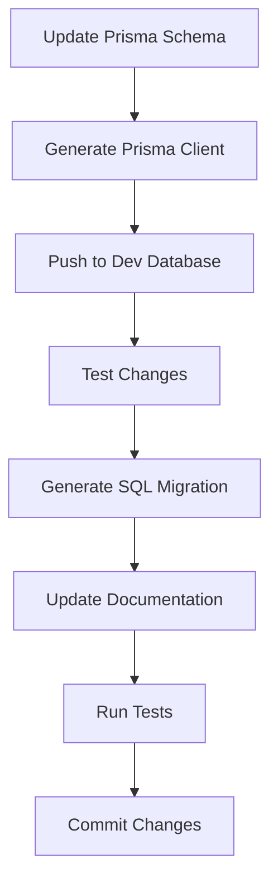

## Database Schema Management

This document describes the database schema management system that enforces Prisma as the single source of truth for database structure.

## Overview

The MS Elevate LEAPS Tracker uses a comprehensive database schema management system that:

- 🎯 **Prisma as Single Source of Truth**: All schema changes start with the Prisma schema
- 🔄 **Automated Migration Generation**: Convert Prisma changes to Supabase migrations
- 🔍 **Drift Detection**: Automatically detect when database schema diverges from Prisma
- 🔐 **Row Level Security**: Comprehensive RLS policies for data protection
- 📖 **Auto-Generated Documentation**: Always up-to-date schema documentation
- 🧪 **Comprehensive Testing**: Fixtures, helpers, and RLS policy tests
- 🤖 **CI/CD Enforcement**: GitHub Actions ensure schema integrity

## Quick Start

### Check Schema Health

```bash
# Check for drift between Prisma and database
pnpm db:check-drift

# Generate fresh schema documentation
pnpm db:docs

# Run RLS policy tests
pnpm db:test-rls
```

### Making Schema Changes

1. **Update Prisma Schema** (`packages/db/schema.prisma`)
2. **Generate Migration**:
   ```bash
   pnpm db:generate-sql my_change_description
   ```
3. **Test Locally**:
   ```bash
   pnpm db:push
   pnpm db:seed
   ```
4. **Update Documentation**:
   ```bash
   pnpm db:docs
   ```
5. **Run Tests**:
   ```bash
   pnpm db:test-rls
   ```

## Available Scripts

### Core Management

| Script                  | Description                         | Usage                  |
| ----------------------- | ----------------------------------- | ---------------------- |
| `pnpm db:check-drift`   | Detect schema drift                 | Run before deployments |
| `pnpm db:generate-sql`  | Generate SQL migrations from Prisma | After schema changes   |
| `pnpm db:sync-supabase` | Sync Supabase with Prisma schema    | Major schema updates   |
| `pnpm db:docs`          | Generate schema documentation       | After schema changes   |
| `pnpm db:test-rls`      | Test RLS policies                   | Before deployments     |

### Existing Scripts

| Script             | Description                          |
| ------------------ | ------------------------------------ |
| `pnpm db:generate` | Generate Prisma client               |
| `pnpm db:migrate`  | Run Prisma migrations (dev)          |
| `pnpm db:push`     | Push schema to database              |
| `pnpm db:seed`     | Seed database with test data         |
| `pnpm db:studio`   | Open Prisma Studio                   |
| `pnpm db:reset`    | Reset database and re-run migrations |

## File Structure

```
elevate/
├── packages/db/
│   ├── schema.prisma              # 🎯 CANONICAL SCHEMA (single source of truth)
│   ├── seed.ts                    # Database seed script
│   └── tests/
│       ├── fixtures.ts            # Test data generators
│       ├── helpers.ts             # Database test utilities
│       └── rls.test.ts           # RLS policy tests
├── supabase/migrations/
│   ├── 00001_enable_rls.sql      # Enable RLS and helper functions
│   ├── 00002_auth_policies.sql   # User authentication policies
│   ├── 00003_submission_policies.sql  # Submission access policies
│   └── 00004_points_policies.sql # Points and audit policies
├── scripts/db/
│   ├── generate-migrations.sh    # Generate SQL from Prisma
│   ├── check-drift.sh           # Detect schema drift
│   └── sync-supabase.sh         # Sync Supabase migrations
├── scripts/
│   └── generate-schema-docs.js   # Generate documentation
├── docs/
│   ├── DATABASE.md               # Auto-generated schema docs
│   └── DATABASE_MANAGEMENT.md    # This file
└── .github/workflows/
    └── schema-enforcement.yml     # CI/CD schema validation
```

## Schema Management Workflow

### 1. Development Workflow



### 2. CI/CD Workflow

When you push changes that modify the schema:

1. **Schema Validation**: Validates Prisma syntax and detects drift
2. **RLS Policy Tests**: Ensures security policies work correctly
3. **Migration Safety**: Checks for potentially destructive operations
4. **Performance Impact**: Assesses query performance impact
5. **Documentation Update**: Auto-generates updated documentation

## Row Level Security (RLS)

### Policy Structure

The database implements comprehensive RLS policies:

- **Users Table**: Users can view/edit their own profiles, public profiles visible to all
- **Submissions Table**: Users own their submissions, reviewers see all, public submissions visible to all
- **Points Ledger**: Users see their own points, reviewers see all, append-only for integrity
- **Audit Log**: Admins only, append-only for security

### RLS Helper Functions

```sql
-- Get current user's role from JWT
SELECT auth.get_user_role();

-- Check if user has admin privileges
SELECT auth.is_admin();

-- Check if user has reviewer privileges
SELECT auth.is_reviewer();

-- Get current user ID
SELECT auth.get_user_id();
```

## Test Database Management

### DatabaseFixtures Class

Generates realistic test data:

```typescript
import { DatabaseFixtures } from '@/packages/db/tests/fixtures'

const fixtures = new DatabaseFixtures(prisma)

// Generate test user
const user = await fixtures.createTestUser({
  handle: 'testuser',
  role: Role.ADMIN,
})

// Create test scenarios
await fixtures.createTestScenario('leaderboard')
```

### Available Test Scenarios

- **basic**: Simple user with one submission
- **leaderboard**: Multiple users with varying points
- **review_queue**: Submissions in different review states
- **comprehensive**: Full dataset for complex testing

### Test Utilities

```typescript
import { TestDatabase, DatabaseAssertions } from '@/packages/db/tests/helpers'

const testDb = new TestDatabase()
const assertions = new DatabaseAssertions(testDb.prisma)

// Verify user exists
await assertions.assertUserExists(userId)

// Check points balance
await assertions.assertPointsBalance(userId, 150)

// Verify submission status
await assertions.assertSubmissionStatus(submissionId, 'APPROVED')
```

## Migration Best Practices

### Safe Migration Patterns

✅ **DO**:

- Add new columns with default values
- Create new tables
- Add indexes (with `CONCURRENTLY` in production)
- Add new constraints that don't conflict with existing data
- Use `ALTER TABLE ADD COLUMN` for new optional fields

❌ **DON'T** (without careful planning):

- Drop tables or columns
- Change column types that could lose data
- Add NOT NULL constraints without defaults
- Remove indexes on large tables
- Rename columns (breaks application code)

### Multi-Step Migration Strategy

For destructive changes:

1. **Step 1**: Add new structure alongside old
2. **Step 2**: Migrate data from old to new
3. **Step 3**: Update application to use new structure
4. **Step 4**: Remove old structure

### Transaction Safety

All migrations should be wrapped in transactions:

```sql
BEGIN;
  -- Migration operations here
  ALTER TABLE users ADD COLUMN new_field TEXT;
  CREATE INDEX CONCURRENTLY idx_users_new_field ON users(new_field);
COMMIT;
```

## Performance Considerations

### Query Performance

The system includes performance monitoring:

- **Leaderboard Queries**: Optimized with materialized views
- **Points Calculations**: Indexed for fast aggregation
- **RLS Policies**: Indexed for efficient filtering

### Monitoring

```javascript
// Benchmark query performance
const { PerformanceHelper } = require('@/packages/db/tests/helpers')
const perf = new PerformanceHelper(prisma)

const { avgDuration } = await perf.benchmarkLeaderboard()
console.log(`Average leaderboard query: ${avgDuration}ms`)
```

## Troubleshooting

### Common Issues

**Schema Drift Detected**:

```bash
# Check what's different
pnpm db:check-drift

# Reset to Prisma schema
pnpm db:push
```

**RLS Policy Failures**:

```bash
# Test specific policies
pnpm db:test-rls

# Check policy definitions
cat supabase/migrations/00002_auth_policies.sql
```

**Migration Failures**:

```bash
# Check migration syntax
./scripts/db/generate-migrations.sh test_migration --no-apply

# Validate against database
pnpm db:check-drift
```

### Debug Commands

```bash
# View database in browser
pnpm db:studio

# Check database connection
psql $DATABASE_URL -c "SELECT version();"

# View current schema
pg_dump $DATABASE_URL --schema-only

# Check RLS policies
psql $DATABASE_URL -c "\\d+ users"
```

## Security Considerations

### Data Protection

- **RLS Enabled**: All tables have Row Level Security enabled
- **JWT-based Access**: User context extracted from JWT tokens
- **Audit Trail**: All administrative actions logged
- **Private by Default**: Submissions are private unless explicitly made public

### Access Control

| Role          | Permissions                         |
| ------------- | ----------------------------------- |
| `PARTICIPANT` | Own data + public content           |
| `REVIEWER`    | All submissions + point management  |
| `ADMIN`       | Full access except system functions |
| `SUPERADMIN`  | Complete system access              |

## Deployment Strategy

### Environment Promotion

1. **Development**: Test schema changes locally
2. **Staging**: Apply migrations to staging database
3. **Production**: Deploy after staging validation

### Zero-Downtime Deployments

- Use `CONCURRENTLY` for index creation
- Avoid blocking operations during peak hours
- Test migration rollback procedures
- Monitor application performance post-deployment

## Contributing

### Schema Change Process

1. **Design**: Plan schema changes with team
2. **Implement**: Update Prisma schema
3. **Test**: Create comprehensive tests
4. **Document**: Update schema documentation
5. **Review**: Submit PR with schema changes
6. **Deploy**: Follow promotion pipeline

### Code Review Checklist

- [ ] Prisma schema updated correctly
- [ ] Migration generated and tested
- [ ] RLS policies cover new/modified tables
- [ ] Tests cover new functionality
- [ ] Documentation updated
- [ ] Performance impact assessed
- [ ] Backward compatibility considered

---

## Support

For questions about database schema management:

1. Check the [auto-generated schema documentation](./DATABASE.md)
2. Review the [Prisma schema](../packages/db/schema.prisma)
3. Run the troubleshooting commands above
4. Consult the team's development guidelines

_This system ensures database integrity, security, and maintainability while providing a smooth developer experience._
