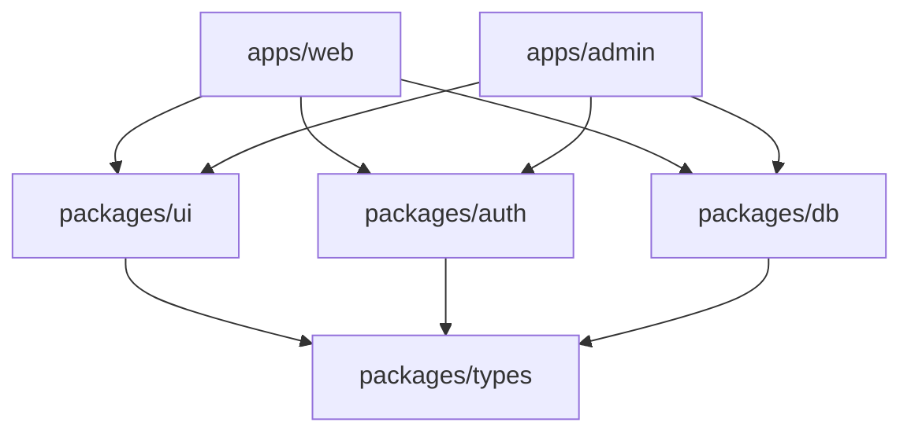

## Core Developer Guide

Single source of truth for building, running, testing, and debugging the MS Elevate LEAPS Tracker.

## Quick Start

### Prerequisites

- **Node.js**: 20.11+ (check with `node --version`)
- **pnpm**: 10+ (install with `npm install -g pnpm`)
- **PostgreSQL**: Local or Supabase instance
- **Git**: For version control

### Initial Setup

```bash
# Clone and install
git clone <repo-url>
cd elevate
pnpm install

# Setup environment
pnpm setup

# Start development
pnpm dev
```

This runs both web (`:3000`) and admin (`:3001`) apps with hot reload.

## Development Workflows

### Core Commands (From Actual package.json)

```bash
# Development (143 total scripts available)
pnpm dev                    # Complex: env validation + DB sync + start both apps
pnpm dev:web               # Web app only (port 3000)
pnpm dev:admin             # Admin app only (port 3001)

# Building & Types
pnpm build                 # env:validate + build all packages/apps
pnpm build:clean           # Clean build via scripts/clean-build.sh
pnpm build:verify          # Check build artifacts with policy
pnpm typecheck:build       # TypeScript compilation (tsc -b)
pnpm build:types           # Build types for all @elevate/* packages

# Database (Prisma + Custom Scripts)
pnpm db:generate           # Generate Prisma client
pnpm db:migrate            # Run dev migrations
pnpm db:migrate:prod       # Deploy production migrations
pnpm db:push               # Sync env + push schema changes
pnpm db:seed               # Seed with test data (ts-node packages/db/seed.ts)
pnpm db:reset              # Reset and re-run migrations
pnpm db:studio             # Open Prisma Studio
pnpm db:check-drift        # Check schema drift
pnpm db:refresh-views      # Refresh materialized views

# Testing (Multiple Test Types)
pnpm test                  # Vitest with tests/vitest.config.ts
pnpm test:unit             # Turbo run test (all packages)
pnpm test:e2e              # Playwright tests
pnpm test:integration      # Integration tests
pnpm test:db               # Database-specific tests
pnpm test:security         # Security package tests

# Linting & Quality
pnpm lint                  # Lint packages + apps
pnpm lint:fix              # ESLint --fix
pnpm verify:all            # Comprehensive validation (scripts/validate-all.mjs)
pnpm verify:imports        # Import path validation
pnpm verify:exports        # Package exports alignment
pnpm verify:code-quality   # Code quality checks
pnpm verify:secrets        # Secret scanning

# Deployment
pnpm deploy                # Deploy both apps (scripts/deploy-apps.sh)
pnpm deploy:web:prod       # Deploy web to production
pnpm deploy:admin:prod     # Deploy admin to production

# Environment & Secrets
pnpm env:validate          # Validate environment variables
pnpm secrets:setup-dev     # Setup development secrets
pnpm secrets:verify        # Verify secrets configuration

# Performance & Analysis
pnpm analyze:bundles       # Bundle analysis
pnpm perf:monitor          # Performance monitoring
pnpm cache:status          # Turbo cache status
```

### Environment Setup

The monorepo uses a root `.env.local` file that cascades to apps:

```bash
# Copy example and fill in values
cp .env.example .env.local

# Key variables (see .env.example for full list)
DATABASE_URL=postgresql://...
NEXT_PUBLIC_CLERK_PUBLISHABLE_KEY=pk_...
CLERK_SECRET_KEY=sk_...
NEXT_PUBLIC_SUPABASE_URL=https://...
SUPABASE_SERVICE_ROLE=...
```

The `pnpm dev` command automatically:

1. Validates required environment variables
2. Syncs DB env to Prisma
3. Starts both apps with proper env inheritance

## Project Architecture

### Monorepo Structure

```
elevate/
├── apps/
│   ├── web/           # Public site + participant dashboard
│   └── admin/         # Admin console for reviewers
├── packages/
│   ├── auth/          # Clerk authentication helpers
│   ├── db/            # Prisma schema + database utilities
│   ├── ui/            # Shared UI components (shadcn/ui)
│   ├── types/         # Shared TypeScript types
│   ├── http/          # API client + response envelopes
│   ├── logging/       # Structured logging
│   └── ...
├── docs/              # Documentation
└── scripts/           # Build, deploy, and utility scripts
```

### Key Technologies

- **Framework**: Next.js 15 with App Router
- **Database**: PostgreSQL via Prisma ORM
- **Auth**: Clerk (Google OAuth)
- **Storage**: Supabase Storage
- **UI**: shadcn/ui + Tailwind CSS
- **Build**: Turborepo + tsup
- **Deployment**: Vercel (separate projects)

### Package Dependencies



## Build System

### Two-Stage Build Process

Per [BUILDING.md](../BUILDING.md), packages use a two-stage build:

1. **Stage 1 (Types)**: `tsc -b` → `dist/types/`
2. **Stage 2 (JS)**: `tsup` → `dist/js/`

```bash
# Build types for all packages
pnpm run build:types

# Build JavaScript bundles
pnpm run build:js

# Full build (both stages)
pnpm build
```

### Package Exports

Each package exports via `package.json` exports field:

```json
{
  "exports": {
    ".": {
      "types": "./dist/types/index.d.ts",
      "import": "./dist/js/index.js"
    },
    "./client": {
      "types": "./dist/types/client.d.ts",
      "import": "./dist/js/client.js"
    }
  }
}
```

### Import Rules

- ✅ Import from published exports: `@elevate/ui`, `@elevate/ui/client`
- ❌ Never import from `src/` or `dist/` directly
- ❌ No deep imports: `@elevate/ui/src/components/Button`

## Database Development

### Schema Changes

1. **Edit Prisma Schema**: `packages/db/schema.prisma`
2. **Generate Migration**: `pnpm db:migrate`
3. **Update Client**: `pnpm db:generate`
4. **Test Changes**: `pnpm db:seed`

### Common Database Tasks

```bash
# View data
pnpm db:studio              # Open Prisma Studio

# Reset database
pnpm db:reset               # Drops, recreates, runs migrations

# Production deployment
pnpm db:migrate:prod        # Deploy migrations to production

# Check for drift
pnpm db:check-drift         # Compare Prisma schema vs database
```

### Seeding Data

The seed script creates realistic test data:

```bash
pnpm db:seed
```

Creates:

- Test users with different roles
- Sample activities and submissions
- Points ledger entries
- Badges and achievements

## Testing

### Test Structure

```
packages/*/
├── src/
│   └── __tests__/         # Unit tests
├── tests/
│   ├── integration/       # Integration tests
│   └── fixtures/          # Test data
```

### Running Tests

```bash
# All tests
pnpm test

# Specific test types
pnpm test:unit             # Unit tests only
pnpm test:integration      # Integration tests
pnpm test:e2e              # End-to-end tests

# Watch mode
pnpm test:watch

# Coverage
pnpm test:coverage
```

### Writing Tests

```typescript
// Unit test example
import { describe, it, expect } from 'vitest'
import { calculatePoints } from '../scoring'

describe('calculatePoints', () => {
  it('awards correct points for Learn activity', () => {
    expect(calculatePoints('learn', { certified: true })).toBe(20)
  })
})

// Integration test with database
import { testDb } from '@elevate/db/test-utils'

describe('User API', () => {
  it('creates user with valid data', async () => {
    const user = await testDb.user.create({
      data: { email: 'test@example.com', name: 'Test User' },
    })
    expect(user.id).toBeDefined()
  })
})
```

## Debugging

### Development Tools

```bash
# Debug specific app
DEBUG=* pnpm dev:web       # Enable debug logging

# Database debugging
pnpm db:studio             # Visual database browser

# Build debugging
pnpm build:verify          # Check build artifacts
pnpm analyze:bundles       # Bundle size analysis
```

### Common Issues

#### Environment Variables

```bash
# Check env validation
pnpm run env:validate

# Sync database env
node scripts/env/sync-db-env-to-prisma.mjs
```

#### Database Connection

```bash
# Test database connection
pnpm db:generate

# Check for schema drift
pnpm db:check-drift
```

#### Build Failures

```bash
# Clean build
pnpm build:clean

# Check TypeScript
pnpm typecheck

# Validate exports
pnpm verify:exports
```

#### Import/Export Issues

```bash
# Validate import paths
pnpm verify:imports

# Check package boundaries
pnpm verify:all
```

### Logging

Use structured logging in development:

```typescript
// In route handlers
import { getSafeServerLogger } from '@elevate/logging/safe-server'

export async function GET() {
  const logger = await getSafeServerLogger('api-users')
  logger.info('Fetching users', { count: 10 })
}

// In client components
import { logger } from '@elevate/logging/client'

logger.debug('Component mounted', { component: 'UserList' })
```

## Performance

### Development Performance

- **Turbopack**: Enabled by default (`--turbo` flag)
- **Hot Reload**: Sub-second updates
- **Incremental Builds**: Only rebuild changed packages

### Monitoring

```bash
# Build performance
pnpm perf:build-time

# Bundle analysis
pnpm analyze:bundles:visual

# Cache performance
pnpm cache:benchmark
```

## Deployment

### Local Testing

```bash
# Build and test locally
pnpm build
pnpm start

# Test production build
NODE_ENV=production pnpm start
```

### Staging/Production

See [Operations Runbooks](./runbooks/deploy.md) for deployment procedures.

## Getting Help

### Documentation

- **Architecture**: [docs/architecture/](./architecture/)
- **API Usage**: [docs/api/](./api/)
- **Database**: [DATABASE.md](./DATABASE.md)
- **Security**: [docs/security/](./security/)

### Troubleshooting

1. **Check validation**: `pnpm verify:all`
2. **Review logs**: Check console output for errors
3. **Database issues**: `pnpm db:studio` to inspect data
4. **Build problems**: `pnpm build:clean` for fresh build

### Team Communication

- **Issues**: Use GitHub issues for bugs/features
- **PRs**: Follow PR template checklist
- **Architecture**: Propose ADRs for significant changes

---

_This guide covers 80% of daily development tasks. For edge cases, see specialized docs or ask the team._
